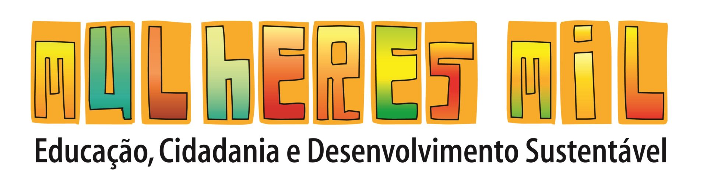

# 🌸 Sistema Mulheres Mil — IF Sudeste MG

<p align="center">
  
</p>

<p align="center">
  <strong>Plataforma de apoio educacional para o Programa Mulheres Mil</strong>
</p>

<p align="center">
  <a href="https://www.ifsudestemg.edu.br/" target="_blank">
    IF Sudeste MG
  </a>
  •
  <a href="https://portal.mec.gov.br/programa-mulheres-mil" target="_blank">
    Programa Mulheres Mil
  </a>
</p>

---

## 📚 Sobre o projeto

O **Sistema Mulheres Mil — IF Sudeste MG** foi desenvolvido inicialmente para atender a uma necessidade identificada durante as atividades do Programa Mulheres Mil no município de **São João Nepomuceno — MG**.

A demanda surgiu principalmente com a utilização da **lousa interativa em sala de aula**.

Antes da criação da plataforma, os professores precisavam utilizar computadores próprios, pendrives ou outros dispositivos para acessar e apresentar os materiais utilizados durante as aulas.

A proposta inicial foi, portanto, criar um ambiente web simples, acessível e centralizado, permitindo que os professores pudessem:

* acessar os materiais diretamente pela lousa interativa;
* apresentar os conteúdos sem a necessidade de levar um computador pessoal;
* eliminar a dependência de pendrives para transportar arquivos;
* centralizar os materiais utilizados nas aulas;
* facilitar a organização dos conteúdos dos cursos.

Com a evolução do projeto e a identificação de novas necessidades, a plataforma passou a atender também as **alunas dos cursos**.

Foi criada uma área específica para que as estudantes possam acessar os materiais das aulas e realizar o **download dos arquivos em PDF**, permitindo que continuem seus estudos em casa.

Atualmente, o projeto também conta com uma área de **login administrativo**, destinada aos profissionais responsáveis pela gestão e acompanhamento dos cursos.

---

# 🎯 Objetivos

O sistema tem como principais objetivos:

* facilitar o acesso aos materiais didáticos;
* apoiar professores durante as aulas;
* aproveitar a infraestrutura de lousas interativas;
* reduzir a necessidade de dispositivos físicos, como pendrives;
* disponibilizar materiais para estudo fora da sala de aula;
* centralizar os conteúdos dos cursos;
* facilitar o gerenciamento acadêmico;
* auxiliar supervisores e orientação no acompanhamento das turmas;
* registrar e acompanhar faltas das estudantes;
* criar uma base tecnológica que possa receber novas funcionalidades.

O projeto foi desenvolvido com uma abordagem **incremental**, sendo ampliado conforme as necessidades identificadas durante a utilização da plataforma. Entre as novas funcionalidades, destaca-se a **Biblioteca Itinerante**, criada para organizar o acervo e facilitar o controle de empréstimos e devoluções de livros.

---

# 🏫 Contexto institucional

O projeto está relacionado às ações do **Programa Mulheres Mil**, desenvolvido no âmbito do **Instituto Federal de Educação, Ciência e Tecnologia do Sudeste de Minas Gerais (IF Sudeste MG)**.

O Programa Mulheres Mil tem como objetivo promover a formação profissional e tecnológica articulada à elevação da escolaridade de mulheres em situação de vulnerabilidade, contribuindo para o acesso à educação, inclusão e autonomia.

No contexto do IF Sudeste MG, o edital de 2026 prevê atuação de profissionais nas funções de orientação e supervisão dos cursos do programa, incluindo atividades relacionadas ao acompanhamento das estudantes, organização de documentos e acompanhamento de frequência.

O sistema foi pensado como uma ferramenta tecnológica de apoio a essas atividades.

---

# 💻 Funcionalidades

## 👩‍🏫 Área dos cursos

A página inicial apresenta os cursos disponíveis na plataforma.

Atualmente, a estrutura contempla:

### 💻 Operadora de Computador

Área destinada aos materiais do curso de **Operadora de Computador**.

### 📚 Assistente Escolar

Área destinada aos materiais do curso de **Assistente Escolar**.

A página inicial utiliza uma interface simples para permitir que a usuária selecione diretamente o curso desejado.

---

# 🖥️ Utilização na lousa interativa

Uma das principais finalidades do sistema é sua utilização diretamente nas **lousas interativas disponíveis na escola**.

O professor pode acessar a plataforma pelo navegador e selecionar o curso e o conteúdo desejado.

Dessa maneira, não é necessário:

* levar notebook pessoal;
* utilizar pendrive;
* copiar arquivos para o computador da sala;
* procurar diferentes arquivos em dispositivos externos.

O conteúdo fica disponível através da própria plataforma.

Essa característica foi o ponto de partida para o desenvolvimento do projeto.

---

# 📥 Materiais para as alunas

Além do uso em sala de aula, a plataforma foi ampliada para permitir que as estudantes tenham acesso aos materiais utilizados durante as aulas.

Os conteúdos podem ser disponibilizados em formato **PDF**, permitindo que as alunas:

* consultem os materiais;
* estudem posteriormente;
* façam download dos arquivos;
* revisem os conteúdos em casa;
* mantenham os materiais para consulta durante o curso.

Essa funcionalidade amplia o uso da plataforma para além da sala de aula.

---

# 🔐 Área administrativa

O projeto também possui uma área de **login**, acessível através do botão localizado na página inicial.

A finalidade dessa área é permitir que usuários autorizados tenham acesso às funcionalidades administrativas da plataforma.

Entre as funções previstas/envolvidas estão:

* acesso restrito por login;
* gerenciamento das informações acadêmicas;
* acompanhamento das turmas;
* controle das estudantes;
* lançamento de faltas;
* acompanhamento da frequência;
* apoio às atividades dos supervisores;
* apoio às atividades da orientação.

A existência dessa área também permite que o projeto evolua posteriormente para um sistema de gestão acadêmica mais completo.

---

# 📊 Controle de frequência

Uma das funcionalidades administrativas do projeto é o **controle de faltas das estudantes**.

A funcionalidade foi pensada para auxiliar os responsáveis pelo acompanhamento das turmas, permitindo registrar a frequência das alunas e manter essas informações organizadas.

Esse recurso está alinhado às atividades de acompanhamento atribuídas à função de supervisão no Programa Mulheres Mil, que incluem o acompanhamento das frequências e dos controles de frequência das alunas.

---

# 🧩 Estrutura atual

A plataforma utiliza uma estrutura web composta por páginas independentes.

A página inicial atualmente apresenta:

```text
Sistema Mulheres Mil
│
├── Página inicial
│   ├── Logo Mulheres Mil
│   ├── Login
│   ├── Operadora de Computador
│   └── Assistente Escolar
│
├── Operadora de Computador
│   └── Materiais do curso
│
├── Assistente Escolar
│   └── Materiais do curso
│
└── Área administrativa
    ├── Login
    ├── Gestão
    └── Controle de frequência
```

A página inicial utiliza HTML e CSS para apresentar os cursos e direcionar as usuárias para suas respectivas áreas.

---

# 🛠️ Tecnologias

O projeto foi desenvolvido utilizando tecnologias web, permitindo sua execução diretamente através de um navegador.

### Tecnologias principais

* **HTML5**
* **CSS3**
* **JavaScript**
* **PDF**
* **Web Browser**

A estrutura foi pensada para funcionar em computadores utilizados pelos professores, lousas interativas e dispositivos das estudantes.

---

# 📱 Responsividade

A plataforma utiliza a configuração:

```html
<meta name="viewport" content="width=device-width, initial-scale=1.0">
```

permitindo adaptação da interface para diferentes tamanhos de tela.

O objetivo é possibilitar o acesso por:

* 🖥️ computadores;
* 🖥️ lousas interativas;
* 💻 notebooks;
* 📱 smartphones;
* 📱 tablets.

---

# 🎨 Interface

A identidade visual do sistema utiliza elementos associados ao **Programa Mulheres Mil**, buscando manter uma apresentação simples, institucional e de fácil utilização.

A interface inicial utiliza:

* cartões de conteúdo;
* botões de acesso aos cursos;
* ícones para identificação das áreas;
* identidade visual do programa;
* layout centralizado;
* elementos responsivos.

O CSS utiliza uma paleta baseada em tons de **laranja e verde**, além de elementos de destaque para facilitar a identificação dos cursos e ações da interface.

---

# 🏛️ Identidade institucional

O projeto utiliza a identidade visual relacionada ao **Programa Mulheres Mil** e ao **IF Sudeste MG**.

As logomarcas oficiais do IF Sudeste MG estão disponibilizadas pelo próprio instituto em sua página oficial de identidade visual:

**IF Sudeste MG — Identidade Visual**

https://www.ifsudestemg.edu.br/comunicacao-social/logos

O instituto também disponibiliza o manual oficial para utilização da marca.

A documentação oficial da identidade visual do **Programa Mulheres Mil** pode ser encontrada no portal do Ministério da Educação:

https://www.gov.br/mec/pt-br/centrais-de-conteudo/marcas/educacao-profissional-e-tecnologica/mulheres-mil/documentos

---

# 🔄 Evolução do projeto

O projeto foi desenvolvido de forma gradual.

### Fase 1 — Necessidade em sala de aula

Identificação da necessidade de utilização da lousa interativa sem depender de computadores pessoais ou pendrives.

⬇️

### Fase 2 — Centralização dos materiais

Criação de uma página para organização dos materiais dos cursos.

⬇️

### Fase 3 — Acesso das estudantes

Disponibilização dos materiais em PDF para que as alunas pudessem realizar os downloads e estudar em casa.

⬇️

### Fase 4 — Área administrativa

Criação de uma área protegida por login para supervisores e orientação.

⬇️

### Fase 5 — Controle acadêmico

Implementação do controle e lançamento de faltas das estudantes.

⬇️

### Fase 6 — Biblioteca Itinerante

Implementação de uma área específica para organização do acervo, cadastro de estudantes, reservas, consultas e registro de devoluções, apoiando a circulação de livros entre as participantes do projeto.

⬇️

### Fase 7 — Evolução contínua

O sistema continuará recebendo atualizações de acordo com as necessidades identificadas durante a execução dos cursos.

---

# 🚀 Próximas atualizações

O projeto possui caráter evolutivo.

Novas funcionalidades poderão ser adicionadas conforme as necessidades dos professores, estudantes, supervisores e orientação.

Entre as possíveis evoluções estão:

* [x] cadastro de estudantes na Biblioteca Itinerante;
* [x] cadastro de livros;
* [x] reserva de livros;
* [x] consulta de livros;
* [x] registro de devolução de livros;
* [ ] cadastro de professores;
* [ ] cadastro de turmas;
* [ ] controle de frequência;
* [ ] relatórios de frequência;
* [ ] histórico de faltas;
* [ ] gerenciamento de materiais;
* [ ] upload de PDFs;
* [ ] organização dos materiais por disciplina;
* [ ] calendário de aulas;
* [ ] comunicados para as estudantes;
* [ ] painel administrativo;
* [ ] diferentes níveis de acesso;
* [ ] melhorias de segurança;
* [ ] melhorias na acessibilidade;
* [ ] melhorias para dispositivos móveis;
* [ ] sistema de notificações;
* [ ] geração de relatórios.

> A implementação dessas funcionalidades dependerá das necessidades identificadas durante a utilização da plataforma.

---

# 🔐 Segurança

A área administrativa possui acesso através de login para restringir funcionalidades destinadas à equipe responsável pela gestão do curso.

Como o sistema trabalha com informações acadêmicas e dados de estudantes, futuras versões deverão priorizar:

* autenticação segura;
* controle de permissões;
* proteção de dados;
* armazenamento seguro;
* registro de alterações;
* gerenciamento de sessões;
* proteção contra acesso não autorizado;
* adequação à legislação aplicável de proteção de dados.

---

# 👥 Público-alvo

O sistema foi desenvolvido para atender principalmente:

### 👩‍🎓 Estudantes

Acesso aos materiais didáticos e PDFs das aulas.

### 👨‍🏫 Professores

Acesso aos conteúdos para utilização durante as aulas e na lousa interativa.

### 👩‍💼 Supervisores

Acompanhamento das turmas e controle de frequência.

### 👩‍💼 Orientação

Acompanhamento acadêmico e apoio à gestão das estudantes e dos cursos.

---

# 📍 Local de desenvolvimento e utilização

**São João Nepomuceno — Minas Gerais, Brasil**

O projeto foi inicialmente concebido para atender às necessidades identificadas no contexto do **Programa Mulheres Mil — IF Sudeste MG**, no campus de São João Nepomuceno.

---

# 👨‍💻 Desenvolvimento

**Felipe Rodrigues**

Especialista em Tecnologia da Informação

🌐 **Portfólio:**
https://feliperodrigues.net

---

# 🏛️ Instituições relacionadas

### Programa Mulheres Mil

Programa do Ministério da Educação voltado à formação profissional e tecnológica de mulheres, articulada à elevação da escolaridade e à inclusão social.

🌐 https://portal.mec.gov.br/programa-mulheres-mil

### IF Sudeste MG

Instituto Federal de Educação, Ciência e Tecnologia do Sudeste de Minas Gerais.

🌐 https://www.ifsudestemg.edu.br/

---

# 📌 Status do projeto

**Status:** 🟢 Em desenvolvimento contínuo

O sistema encontra-se em evolução e novas funcionalidades poderão ser incorporadas conforme as necessidades do Programa Mulheres Mil e da equipe responsável pelos cursos.

---

# 📄 Licença

Este projeto foi desenvolvido especificamente para apoiar as atividades educacionais e administrativas relacionadas ao Programa Mulheres Mil.

A definição de licença, distribuição e reutilização do código deverá ser estabelecida pelo responsável pelo projeto e/ou pela instituição responsável pela sua utilização.

---

<p align="center">
  <strong>Mulheres Mil • Educação, Cidadania e Desenvolvimento Sustentável</strong>
</p>

<p align="center">
  Desenvolvido por <strong>Felipe Rodrigues</strong>
</p>
